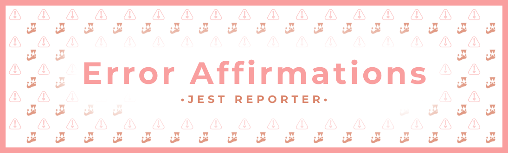
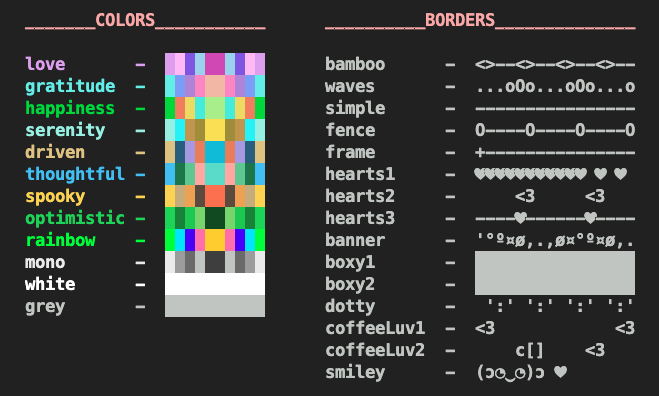
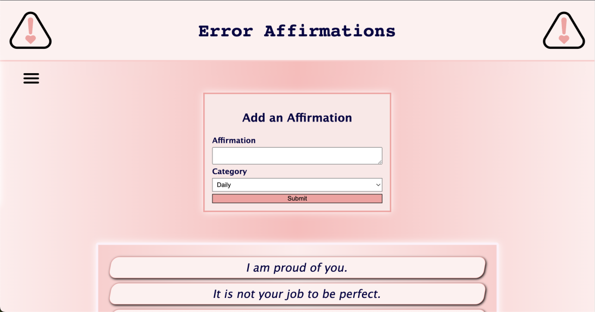

# Error Affirmations - Jest Reporter

_"You are_ **_not_** _defined by your code"_



Receive all your favorite _Error Affirmations_, when you need them most!

With an easy install and a variety of options for customization, our Jest Reporter is sure to help soften the blow from any failing tests and give you the confidence to carry on!

## Made with

&nbsp;&nbsp;

## Features

* Affirmations are **automatically displayed** alongside your Jest test report, whenever your tests fail.
* Affirmations are fetched from the [**Error Affirmations API**](https://github.com/VSCode-Empaths/VSCode-Affirmations-Backend), which uses Affirmations submitted from users worldwide.
* **Customize** the look and feel with our large selection of color palettes and border themes!
* Change mode to "info" to reveal **instructions** and configuration options in your terminal.

## Preview


## Usage

1\. **Install** using npm

```bash
npm i --save-dev error-affirmations
```

2\. **Configure** Jest to use our custom [reporter](https://jestjs.io/docs/configuration#reporters-arraymodulename--modulename-options) by putting the following in your package.json

```javascript
"jest": {
     "reporters":
        [
            "default",
            "error-affirmations"
        ]
    },
```

3\. **Run** Jest as usual

```bash
jest
```

4\. **Receive** an Error Affirmation!


## Configure

Optionally change the **Color-Palette** and **Border-Theme** by adding an extra config in your package.json

```javascript
  jest: {
    reporters: [
      "default",
      ["error-affirmations",
        {
          colorTheme: "driven",
          borderTheme: "waves",
          mode: "normal",
        },
      ],
    ],
  }
```

Here, we have selected _"driven"_ as the color theme and _"waves"_ as the border theme. You may change these values to suit your own preferences!

To see a list of all the available colors and borders, change the `"mode"` to `"info"` and the next time your affirmation is displayed, the following info will appear:



The `"mode"` may also be set to `"minimal"` which will hide any borders and just show the affirmations.

## Authors

* [Rio Edwards](https://github.com/rioredwards)
* [Karl Wernsman](https://github.com/orgs/VSCode-Empaths/people/karlwernsman)
* [Kevin Nail](https://github.com/orgs/VSCode-Empaths/people/kevinnail)
* [Zach Sultan](https://github.com/Zacharyjsultan)

## Check Out Our Other Apps!

### VSCode Extension

[Try](https://marketplace.visualstudio.com/items?itemName=VSCodeEmpaths.erroraffirmations) \- [GitHub](https://github.com/VSCode-Empaths/VSCode-Affirmations-Extension-Frontend)


### Website

[Try](https://error-affirmations.netlify.app/) \- [GitHub](https://github.com/VSCode-Empaths/VSCode-Affirmations-Web-Frontend)



### Backend

[GitHub](https://github.com/VSCode-Empaths/VSCode-Affirmations-Backend)

