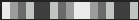
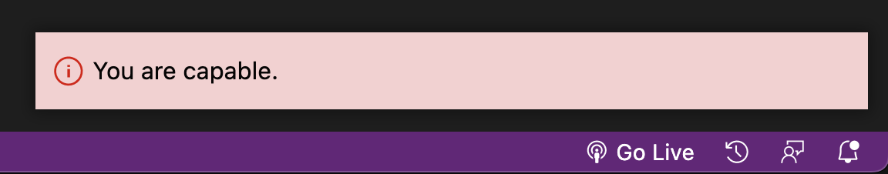

# Error Affirmations - Jest Reporter


Error Affirmations Jest Reporter gives you much needed code-related affirmations whenever your tests fail.

GitHub - https://github.com/VSCode-Empaths/VSCode-Affirmations-Jest-Reporter

<br>

### **Preview**


<br>

### Customize with **Color** and **Border** Themes!!!


<br>

## **Installation**

You may install this package as a development dependency:

```bash
npm i --save-dev error-affirmations
```

<br>

## **Configuration**

Configure [Jest](https://facebook.github.io/jest/docs/en/configuration.html) to use the reporter:

For example, add the following "jest" configuration in your package.json file:
(include the "default" reporter to keep jest's default reporter output)

```json
 "jest": {
     "reporters":
        [
            "default",
            "error-affirmations"
        ]
    },
```

<br>

### (Optionally) Customize the **color** and **border** theme

```json
"jest": {
     "reporters": [
         "default",
        ["error-affirmations",
            { "color": "driven", "border": "waves"}
        ]
    ]
},
```

<br>

### **Color and Border Theme Options**:

(A list of the available colors and borders can also be displayed in the reporter options by adding "mode": "info", in the reporter options)

```json
    "mode": "info",
```

| colorTheme |                                                                            | borderTheme |                  |
| ---------- | -------------------------------------------------------------------------- | ----------- | ---------------- |
| love       |              | bamboo      | <>--<>--<>--<>-- |
| happiness  |    | waves       | ...oOo...oOo...o |
| serenity   |      | simple      | ---------------- |
| driven     |          | fence       | O----O----O----O |
| spooky     |          | frame       | +--------------+ |
| optimistic |  | hearts1     | <3 <3 <3         |
| rainbow    |        | hearts2     | <3 <3 <3         |
| mono       |              | banner      | '°º¤ø,.,ø¤°º¤ø,. |
| white      |            | dotty       | ':' ':' ':' ':'  |
| grey       |              | coffeeLuv1  | <3 c[] <3        |
|            |                                                                            | coffeeLuv2  | <3 c[] <3        |
|            |                                                                            | smiley      | (ɔ◔‿◔)ɔ ♥        |

<br>

## **Check out our other apps!**

#### **Error Affirmations** - VS Code Extension:

https://marketplace.visualstudio.com/items?itemName=VSCodeEmpaths.erroraffirmations



#### **Error Affirmations** - Website:

https://error-affirmations.netlify.app/

<br>

## **Meet the team**

-   Karl Wernsman - <a href="https://www.linkedin.com/in/karl-wernsman/" >LinkedIn</a>
-   Kevin Nail - <a href="https://www.linkedin.com/in/kevinnail/" >LinkedIn</a>
-   Rio Edwards - <a href="https://www.linkedin.com/in/rio-edwards/" >LinkedIn</a>
-   Zach Sultan - <a href="https://www.linkedin.com/in/zachary-sultan/" >LinkedIn</a>
